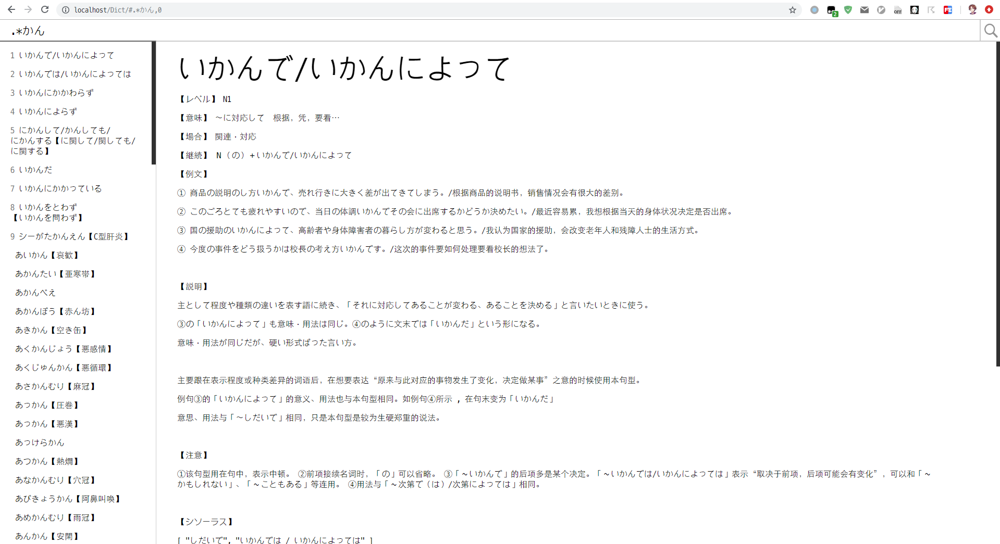
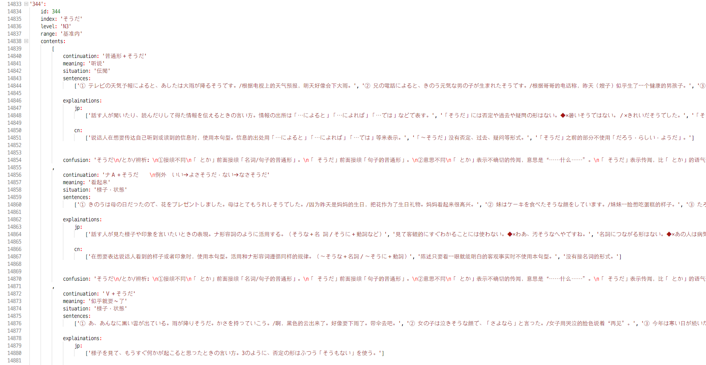

# Dict http://shenhongfei.site/Dict/

## 简介

一个简洁、智能、美观的自用电子词典，所有操作都能通过快捷键完成，如搜索、词条选择、上下滚动、前进后退

查询后直接播放单词发音，配图可点击放大，可用 CSS 自定义词条样式，整合了英语词根词源

词典可同时查询英语单词、日语单词，日语语法，支持正则表达式搜索超过十万个词条

词条数据来自 mdict 词典文件，使用 MongoDB 存储，后端使用 Koa、前端使用 Vue

## 预览

搜索日语语法时也可根据 【レベル】 或 【場合】 进行筛选、学习，如想要学习 N5 语法只需在搜索框中输入 N5 ，回车即可

## 词典

| 词典                           | 词条数 |
| ------------------------------ | ------ |
| 牛津高阶英汉双解词典（第８版） | 92667  |
| 講談社日中辞典                 | 85958  |
| N1 - N5 所有日语语法           | 1357   |

## 快捷键（全程无需鼠标）

#### 全局

Esc 聚焦输入框并清空

#### 焦点位于输入框

Enter 查询单词（正则表达式）

#### 焦点不位于输入框

| 按键          | 功能                             |
| ------------- | -------------------------------- |
| Tab/Shift+Tab | 上下移动条目                     |
| e             | 聚焦输入框编辑查询内容（不清空） |
| f 或 s        | 聚焦输入框输入查询内容（清空）   |
| j/J           | 向下滚动／直达底部               |
| k/K           | 向上滚动／直达顶部               |
| h             | 后退，转到上一个历史查询词条     |
| l             | 前进，转到下一个历史查询词条     |
| Enter (双击)  | Google Search                    |
| 1 - 9         | 切换至对应编号条目               |

(大写字母表示按住 Shift + 相应按键)

## 数据

图标等资源文件下载地址 https://1drv.ms/u/s!AhmzONd8r6bOjhSXEdGbzTCOJUaG

下载后解压至文件夹内

MongoDB 数据库下载地址 https://1drv.ms/u/s!AhmzONd8r6bOjhOoxJHasJuWADLP

下载后使用 mongoimport 导入

语法数据 grammars.db.zip 下载地址 https://1drv.ms/u/s!AhmzONd8r6bOjhcUD1du7SNewF_I

